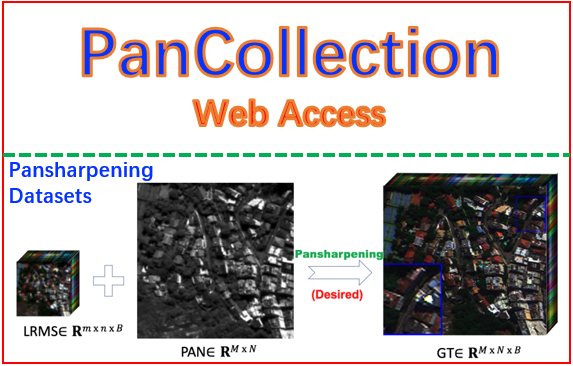

<div>
&nbsp;&nbsp;&nbsp;&nbsp;&nbsp;&nbsp;&nbsp;&nbsp;&nbsp;&nbsp;&nbsp;&nbsp;<a href="https://github.com/liangjiandeng/DLPan-Toolbox"></a>
&nbsp;&nbsp;&nbsp;&nbsp;&nbsp;&nbsp;&nbsp;&nbsp;&nbsp;&nbsp;&nbsp;&nbsp;<a href="https://liangjiandeng.github.io/PanCollection.html"></a>
</div>


# "PanCollection" for Remote Sensing Pansharpening (Make Available on [PyPI](https://pypi.org/project/pancollection/) :tada:)

[English](https://github.com/XiaoXiao-Woo/PanCollection/edit/dev/README.md) | [简体中文](https://github.com/XiaoXiao-Woo/PanCollection/edit/dev/README_zh.md)

This repository is the official PyTorch implementation of “基于卷积神经网络的遥感图像全色锐化进展综述及相关数据集发布” ([paper](https://liangjiandeng.github.io/papers/2022/deng-jig2022.pdf), [homepage](https://liangjiandeng.github.io/PanCollection.html)).

* Release the PanCollection of the pan-sharpening training-test dataset of related satellites (such as WorldView-3, QuickBird, GaoFen2, WorldView-2 satellites); 
* Release the Python code based on the unified Pytorch framework , which is convenient for later scholars;
* Release a unified Pansharpening traditional-deep learning method (including MATLAB test software package), which is convenient for later scholars to conduct fair tests.
* Make available on [PyPI](https://pypi.org/project/pancollection/).
* Added Colab Demo. []([https://colab.research.google.com/drive/1C2818h7KnjNv4R1sabe14_AYL7lWhmu6?usp=sharing](https://colab.research.google.com/drive/1KpWWj1lVUGllZCws01zQfd6CeURuGL2O#scrollTo=k53dsFhAdp6n))

See the [repo](https://github.com/liangjiandeng/PanCollection) for more detailed descriptions. 

See the [PanCollection Paper](https://liangjiandeng.github.io/papers/2022/deng-jig2022.pdf) for early results.


## Recommendations

We recommend users to use the code-toolbox [DLPan-Toolbox](https://github.com/liangjiandeng/DLPan-Toolbox/tree/main/02-Test-toolbox-for-traditional-and-DL(Matlab)) + the dataset [PanCollection](https://drive.google.com/drive/folders/15VXUjqPybtqUN_spKfJbw40W05K4nDdY?usp=sharing) for fair training and testing!

## Datasets (Reduced and Full)

| **Satellite** | **Value** | **Comment**                            |
|--------------------|-----------|----------------------------------------|
| WorldView-3        | 2047      |   Training; Testing; Generalization   |
| QuickBird          | 2047      |    Training; Testing   |
| GaoFen-2           | 1023      |    Training; Testing   |
| WorldView-2        | 2047      |    Training; Testing; Generalization        |

## Requirements
* Python3.7+, Pytorch>=1.9.0
* NVIDIA GPU + CUDA

Note: Our project is based on MMCV, but you needn't to install it currently.

## Quick Start

🤗 To get started with PanCollection benchmark (training, inference, etc.), we recommend reading [Google Colab](https://colab.research.google.com/drive/1KpWWj1lVUGllZCws01zQfd6CeURuGL2O#scrollTo=k53dsFhAdp6n)!

```python
import pancollection as pan
cfg = pan.TaskDispatcher.new(task='pansharpening', mode='entrypoint', arch='FusionNet', 
                             dataset_name="gf2", use_resume=False,
                             dataset={'train': 'gf2', 'test': 'test_gf2_multiExm1.h5'})
print(pan.TaskDispatcher._task)
pan.trainer.main(cfg, pan.build_model, pan.getDataSession)
```
### Quick Start for Developer

**Step0.** set your Python environment.

>git clone https://github.com/XiaoXiao-Woo/PanCollection

Then, 

> python setup.py develop


or

> pip install -i pancollection https://pypi.org/simple

**Step1.**
* Download datasets (WorldView-3, QuickBird, GaoFen2, WorldView2) from the [homepage](https://liangjiandeng.github.io/PanCollection.html). Put it with the following format. 

* Verify the dataset path in `PanCollection/UDL/Basis/option.py`, or you can print the output of `run_pansharpening.py`, then set __cfg.data_dir__ to your dataset path.

```
|-$ROOT/Datasets
├── pansharpening
│   ├── training_data
│   │   ├── train_wv3.h5
│   │   ├── ...
│   ├── validation_data
│   │   │   ├── valid_wv3.h5
│   │   │   ├── ...
│   ├── test_data
│   │   ├── WV3
│   │   │   ├── test_wv3_multiExm.h5
│   │   │   ├── ...
```

**Step2.** Open `PanCollection/UDL/pansharpening`,  run the following code:

> python run_pansharpening.py

**step3.** How to train/validate the code.

* A training example：

	run_pansharpening.py
  
	where arch='BDPN', and configs/option_bdpn.py has: 
  
	__cfg.eval__ = False, 
  
	__cfg.workflow__ = [('train', 50), ('valid', 1)], __cfg.dataset__ = {'train': 'wv3', 'valid': 'wv3_multiExm.h5'}
	
* A test example:

	run_test_pansharpening.py
  
	__cfg.eval__ = True or __cfg.workflow__ = [('test', 1)]

**Step4.** How to customize your model.
```pythonn
def run_demo():
    import os 
    os.environ["CUDA_DEVICE_ORDER"] = "PCI_BUS_ID"
    os.environ["CUDA_VISIBLE_DEVICES"] = "0"

    from <your_model_file> import build
    from pancollection.configs.configs import TaskDispatcher
    from udl_vis.AutoDL.trainer import main
    from pancollection.common.builder import build_model, getDataSession
    import option_<your_model_file> # please refer to https://github.com/XiaoXiao-Woo/PanCollection/blob/main/pancollection/configs/option_fusionnet.py


    cfg = TaskDispatcher.new(task='hisr', mode='entrypoint', arch='your_model_name', **data_path,
                             workflow=[('train', 10), ('valid', 1), ('test', 1)], resume_from="", experimental_desc="LN")
                            #  **data_path)
                            #  , data_dir="/Data/Datasets/hisr")
    print(TaskDispatcher._task.keys())

    main(cfg, build_model, getDataSession)

if __name__ == '__main__':
    run_demo()

```


**Step5.** How to customize the code.

One model is divided into three parts:

1. Record hyperparameter configurations in folder of `PanCollection/UDL/pansharpening/configs/option_<modelName>.py`. For example, you can load pretrained model by setting __model_path__ = "your_model_path" or __cfg.resume_from__ = "your_model_path".

2. Set model, loss, optimizer, scheduler in folder of `PanCollection/UDL/pansharpening/models/<modelName>_main.py`.

3. Write a new model in folder of `PanCollection/UDL/pansharpening/models/<modelName>/model_<modelName>.py`.

Note that when you add a new model into PanCollection, you need to update `PanCollection/UDL/pansharpening/models/__init__.py` and add option_<modelName>.py.

**Others**
* if you want to add customized datasets, you need to update:

```
PanCollection/UDL/AutoDL/__init__.py.
PanCollection/UDL/pansharpening/common/psdata.py.
```

* if you want to add customized tasks, you need to update:

```
1.Put model_<newModelName> and <newModelName>_main in PanCollection/UDL/<taskName>/models.
2.Create a new folder of PanCollection/UDL/<taskName>/configs to put option_<newModelName>.
3.Update PanCollection/UDL/AutoDL/__init__.
4.Add a class in PanCollection/UDL/Basis/python_sub_class.py, like this:
class PanSharpeningModel(ModelDispatcher, name='pansharpening'):
```

* if you want to add customized training settings, such as saving model, recording logs, and so on. you need to update:

```
PanCollection/UDL/mmcv/mmcv/runner/hooks
```

Note that: Don't put model/dataset/task-related files into the folder of AutoDL.

* if you want to know more details of runner about how to train/test in `PanCollection/UDL/AutoDL/trainer.py`, please see PanCollection/UDL/mmcv/mmcv/runner/epoch_based_runner.py

## Plannings
	
- [ ] [hugging face 🤗](https://huggingface.co/datasets/elsting/PanCollection)
  - [ ] Integrated into [Huggingface Spaces 🤗](https://huggingface.co/spaces) using [Gradio](https://github.com/gradio-app/gradio). Try out the web demo: [Hugging Face Spaces](https://huggingface.co/spaces/elsting/PanCollection)

- [ ] Support more models	

- [ ] Make the [Leaderboard](https://paperswithcode.com/dataset/worldview-3-pancollection) for model results.

## Contribution
We appreciate all contributions to improving PanCollection. Looking forward to your contribution to PanCollection.


## Citation
Please cite this project if you use datasets or the toolbox in your research.
```
@misc{PanCollection,
    author = {Xiao Wu, Liang-Jian Deng and Ran Ran},
    title = {"PanCollection" for Remote Sensing Pansharpening},
    url = {https://github.com/XiaoXiao-Woo/PanCollection/},
    year = {2022},
}
```

```
@ARTICLE{dengjig2022,
	author={邓良剑，冉燃，吴潇，张添敬},
	journal={中国图象图形学报},
	title={遥感图像全色锐化的卷积神经网络方法研究进展},
 	year={2022},
  	volume={},
  	number={9},
  	pages={},
  	doi={10.11834/jig.220540}
   }
```

```
@ARTICLE{deng2022grsm,
author={L.-J. Deng, G. Vivone, M. E. Paoletti, G. Scarpa, J. He, Y. Zhang, J. Chanussot, and A. Plaza},
booktitle={IEEE Geoscience and Remote Sensing Magazine},
title={Machine Learning in Pansharpening: A Benchmark, from Shallow to Deep Networks},
year={2022},
pages={2-38},
doi={10.1109/MGRS.2020.3019315}
}
```

## Acknowledgement
- [MMCV](https://github.com/open-mmlab/mmcv): OpenMMLab foundational library for computer vision.

## License & Copyright
This project is open sourced under GNU General Public License v3.0.
